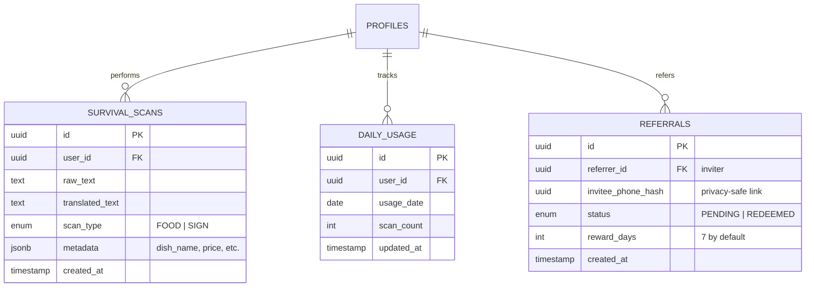

# Database Schema: SurvivalScan (PostgreSQL / Supabase)

**Version:** 1.0.0 (MVP)  
**Status:** PROPOSED (Phase 2 of Kickoff)  
**Engine:** PostgreSQL (Supabase)

---

## 1. Logical ERD (Mermaid)



---

## 2. Physical Schema (SQL / Migrations)

### Tables

```sql
-- Track individual scan history
CREATE TABLE public.survival_scans (
  id UUID PRIMARY KEY DEFAULT gen_random_uuid(),
  user_id UUID REFERENCES auth.users(id) ON DELETE CASCADE,
  raw_text TEXT NOT NULL,
  translated_text TEXT,
  scan_type VARCHAR(20) CHECK (scan_type IN ('FOOD', 'SIGN')),
  metadata JSONB DEFAULT '{}'::JSONB,
  created_at TIMESTAMP WITH TIME ZONE DEFAULT NOW()
);

-- Enable RLS on scans
ALTER TABLE public.survival_scans ENABLE ROW LEVEL SECURITY;
CREATE POLICY "Users can only see their own scans" ON public.survival_scans
  FOR SELECT USING (auth.uid() = user_id);

-- Track daily scan counts for the Soft Paywall
CREATE TABLE public.daily_usage_limits (
  id UUID PRIMARY KEY DEFAULT gen_random_uuid(),
  user_id UUID REFERENCES auth.users(id) ON DELETE CASCADE,
  usage_date DATE DEFAULT CURRENT_DATE,
  scan_count INT DEFAULT 0,
  updated_at TIMESTAMP WITH TIME ZONE DEFAULT NOW(),
  UNIQUE(user_id, usage_date)
);

-- Logic for viral referrals
CREATE TABLE public.referral_history (
  id UUID PRIMARY KEY DEFAULT gen_random_uuid(),
  referrer_id UUID REFERENCES auth.users(id),
  invitee_id UUID REFERENCES auth.users(id), -- Only filled when they sign up
  status VARCHAR(20) DEFAULT 'PENDING' CHECK (status IN ('PENDING', 'REDEEMED')),
  reward_days INT DEFAULT 7,
  created_at TIMESTAMP WITH TIME ZONE DEFAULT NOW()
);
```

### Proposed Indexes

```sql
CREATE INDEX idx_survival_scans_user_id ON public.survival_scans(user_id);
CREATE INDEX idx_daily_usage_user_date ON public.daily_usage_limits(user_id, usage_date);
CREATE INDEX idx_referral_referrer_id ON public.referral_history(referrer_id);
```

---

## 3. BA & Backend Review Checklist

- `[x]` **Cascade Integrity:** Scans are deleted if the user profile is deleted (`CASCADE`).
- `[x]` **Scalability:** `metadata` field allows for future extraction of "Price", "Calories", or "Ingredients" without DDL changes.
- `[x]` **Privacy:** `raw_text` is stored, but clear instructions in the Privacy Policy are required to satisfy Apple Guidelines.
- `[/]` **Monetization:** `daily_usage_limits` is the backbone of our PLG/Paywall strategy. It must be checked before every scan request.

---
**END OF SCHEMA**
