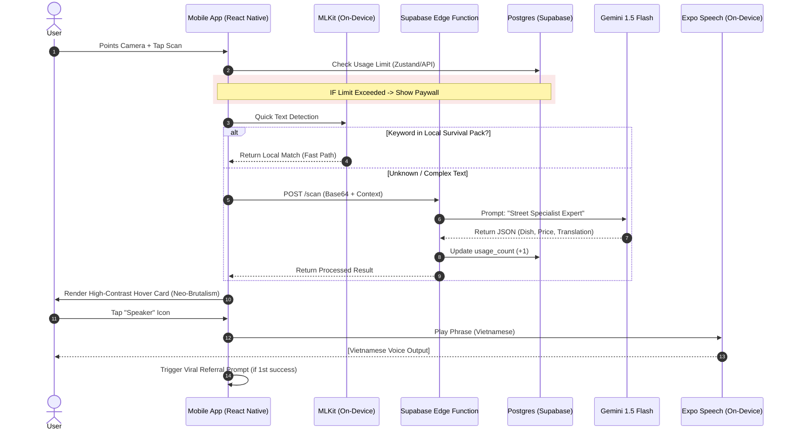

# Sequence Diagram: SurvivalScan Interactive Loop

This diagram maps the interaction between the User, App (Client), and Backend Services for a single scan event.

### Key Optimizations:
1.  **Fast-Path Recognition:** By checking `MLKit` local keywords first, we reduce Cloud AI latency and costs for common items (e.g., "Phở", "Toilet").
2.  **Usage Gating:** The check happens *before* expensive AI processing to protect the API quota.
3.  **On-Device TTS:** We use `expo-speech` to avoid the data costs and latency of a cloud-based TTS engine.
