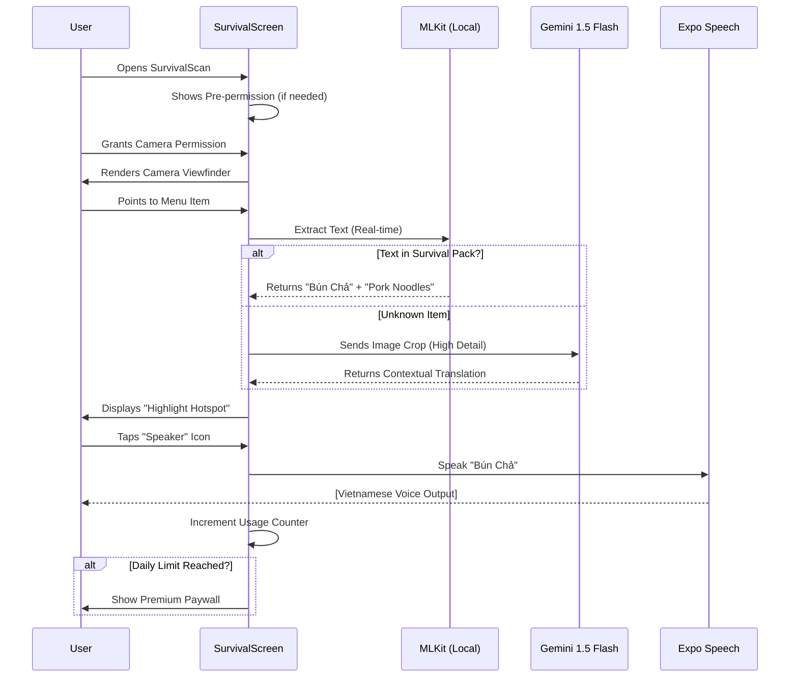

# Software Requirements Specification (SRS): SurvivalScan

**Version:** 1.0.0 (MVP)  
**Status:** DRAFT (Awaiting Approval)  
**Feature Lead:** Senior Product Owner & Senior AI Engineer

---

## 1. Context & Goals
**SurvivalScan** is an interactive sign and menu translation tool designed for the "Survival" module of the XinChao app. Unlike generic translators, it targets specific localized entities helpful for immediate "survival" in Vietnam (Food, Prices, Directions).

- **Objective:** Enable travelers to read and *speak* based on context from their environment.
- **Goal:** Drive "Time-to-Value" in <15 seconds (Scan to Order).
- **Core Value:** "Don't just read it, survive it."

---

## 2. User Stories (Agile Standard)

| ID     | Role           | Requirement                                   | Benefit                                                  |
| :----- | :------------- | :-------------------------------------------- | :------------------------------------------------------- |
| **US.1** | Hungry Tourist | Scan a messy street food menu offline         | Order food without language barrier or internet.          |
| **US.2** | Lost Traveler  | Scan a street sign for "Nhà vệ sinh" (Toilet) | Find local amenities quickly without panic.              |
| **US.3** | Budget User    | Hear the menu item name pronounced by AI      | Pronounce the dish correctly to the vendor or show it.    |
| **US.4** | Free User      | Scan 3-5 items for free daily                 | Test the premium value before upgrading (PLG Strategy).    |
| **US.5** | Premium User   | Scan unlimited signs & menus                  | Full peace of mind while exploring off-the-beaten-path. |

---

## 3. Functional Requirements

### FR.1: Survival-Focused OCR
- System MUST prioritize recognition of:
    - **Food Items:** (e.g., Phở, Bún riêu, Bánh mì, Nem nướng).
    - **Modifiers:** (e.g., Cực cay, Không đường, Có đá).
    - **Signs:** (e.g., Lối ra, Cấm vào, Nhà vệ sinh).
- System MUST support both Local (`expo-mlkit`) and Cloud (`Gemini 1.5 Flash`) modes.

### FR.2: On-device "Scan-to-Speak"
- Each identified entity MUST display a "Speaker" icon.
- Tapping the icon triggers AI Voice (Vietnamese) using `expo-speech`.

### FR.3: Offline Matcher
- The app MUST allow downloading a <1MB "Survival Pack" (JSON).
- Local OCR MUST lookup keywords in the downloaded JSON when offline.

### FR.4: Soft Paywall & Usage Tracking
- System MUST track daily successful scans per device ID.
- Access MUST be restricted after 5 free scans, prompting a Neo-Brutalist payment screen.

### FR.5: Viral Referral Loop
- After a successful first scan of a menu, a toast/modal MUST appear: "Save your friends! Share and get 7 days of Premium."

---

## 4. Non-Functional Requirements
- **Performance:** Recognition time < 1.0s (Local) or < 2.5s (Cloud).
- **Security:** Images MUST NOT be permanently stored on the cloud; only processed in memory.
- **Privacy:** Pre-permission screen requirement (Compliance with Apple 5.1.2).

---

## 5. Flow of Events

---

## 6. Acceptance Criteria (Given/When/Then)

**Scenario: Successful Menu Translation**
- **Given** a user is facing a menu with "Phở Bò"
- **When** they point the camera at the text
- **Then** the screen should draw a thin 2px black border around "Phở Bò"
- **And** show a yellow card saying "Beef Noodle Soup" with a Speaker icon.

**Scenario: User is Offline**
- **Given** the user has no internet but has downloaded the "Survival Pack"
- **When** they scan a sign saying "LỐI RA"
- **Then** the system should instantly show "EXIT" from the local cache.

---

## 7. Data Dictionary

| Field | Type | Description | Constraints |
| :--- | :--- | :--- | :--- |
| `usage_count` | Number | Number of scans used today | 0 - 9999 |
| `last_reset_date` | Date | Last time usage count was reset | ISO String |
| `survival_pack_id` | String | Version of the downloaded JSON | e.g. "v1.2-tourist" |
| `ocr_confidence` | Float | Probability of correct recognition | 0.0 - 1.0 |

---

## 8. UX States & Validation (Neo-Brutalism)

- **isLoading:** Bouncing "Little Plastic Stool" icon with text "He's reading fast...".
- **Empty State:** Dotted rectangle in viewfinder: "Point at something tasty!".
- **Error State (Bé Ghế Nhựa):**
    - UI: Red Card, 4px Hard Shadow.
    - Copy: "Oops! Món này lạ quá, Bé Ghế Nhựa chưa học kịp. Hãy thử tự gõ tay nhé!"
    - Action: "Type Manually" button.

---

## 9. Compliance & Review Notes

### Apple/Google Reviewer Guide
- **Demo Mode:** Include a "Test Image" button in the dev menu or provide a QR code to a sample menu.
- **Reviewer Note:** "This app uses camera OCR for translation. To test, please use the provided sample menu PDF attached in the Reviewer notes."
- **Privacy Policy:** Must explicitly mention Camera and Audio usage for translation purposes only.

---
**END OF SPECIFICATION**
