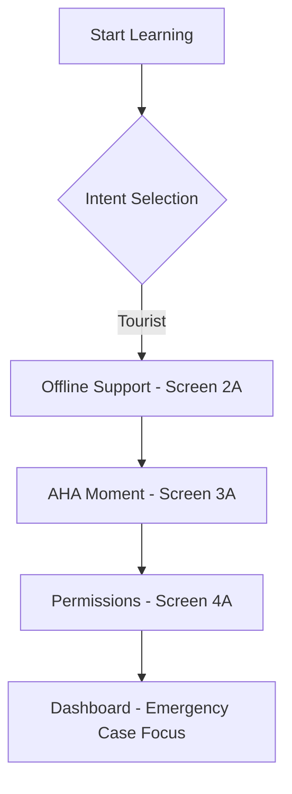

# PRD: Onboarding Branch A - Tourist Target

## 1. Overview

**Philosophy:** "Nhanh gọn, Sinh tồn, Ngoại tuyến" (Fast, Survival, Offline).
**Goal:** Reduce Time-to-Value (TTV) to under 1 minute for short-term tourists in Vietnam.

## 2. User Stories

- **As a tourist,** I want to know that I can use the app without Wi-Fi so I feel safe using it on the streets.
- **As a new learner,** I want to experience the app's core value (pronunciation and interactive cards) immediately to feel motivated.
- **As a user,** I want to understand why the app needs my camera and location before the system prompt appears to increase my trust.

## 3. Screen Specifications

### Screen 2A: Core Feature - Offline Support (`offline.tsx`)

- **Copy:** "No Wi-Fi? No Problem." (Không có mạng? Không sao cả).
- **Logic:** Trigger silent background download of "Gói sinh tồn 24h" (Offline Cache).
- **UI:** 
  - Neo-brutalism Progress Bar (Thick black borders, vibrant colors).
  - Clear progress feedback to avoid perceived "stalled" state.

### Screen 3A: AHA Moment - Interactive Learning (`aha.tsx`)

- **UI:** A giant static Flashcard showing "Bao nhiêu tiền?".
- **Interaction:** 
  - Click Loudspeaker icon -> Play audio pronunciation.
  - **Game Juice:** On audio play, trigger 2D Flat Firework particle effect + falling coin animation.
- **Reward:** Instant +10 XP added to the user profile.

### Screen 4B: Contextual Permissions (`permissions.tsx`)

- **Purpose:** Explain data usage before OS prompt.
- **Camera:** Scan Menu/Signs (OCR).
- **Location:** Geo-contextual Push Notifications (Tourist spots).
- **UI:** Focus on clarity and trust building.

### Destination

- Redirect to `Dashboard` (`app/(tabs)/index.tsx`).
- Dashboard should prioritize "Emergency/Survival" situations (Ordering food, asking for directions).

## 4. Acceptance Criteria

- Offline progress bar matches Neo-brutalism style (2px borders, no blur).
- XP reward is persisted to Supabase/Global store.
- Firework effect is "flat" style to match UI rules.
- Onboarding flow correctly branches for "Tourist" intent.

## 5. Flow Diagram

